# 驭安DriveSafe 系统 Mermaid 图表集

> 本文档汇总了驭安DriveSafe主动安全预警系统的核心流程图和架构图，以Mermaid代码形式呈现。所有图表均基于系统的工程实现和技术方案，旨在直观展示系统的各个模块、流程和数据流向。

---

## 1. 系统整体架构图

**题注：驭安DriveSafe系统整体架构图，展示了从视频输入到预警输出的完整流水线**

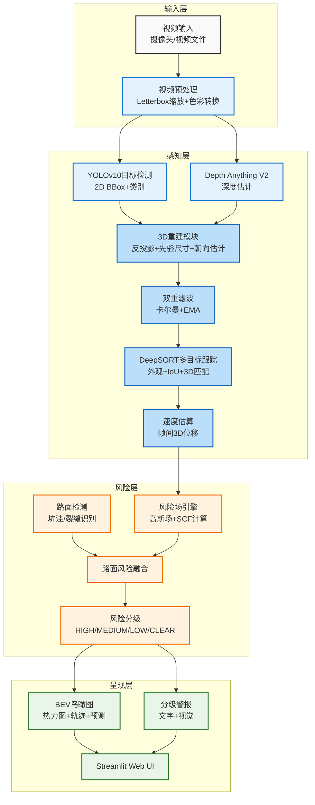

---

## 2. 系统数据流图

**题注：系统数据流向图，展示了从原始视频帧到最终预警的完整数据传递路径**

```mermaid
flowchart LR
    A[原始视频帧] --> B[预处理帧\n640×640 RGB]
    A --> C[原始帧\nBGR格式]
    
    B --> D[YOLOv10推理\n2D BBox+类别+置信度]
    C --> E[Depth Anything V2\n深度图]
    
    D --> F[3D重建\n反投影+先验尺寸]
    E --> F
    F --> G[卡尔曼滤波\n11维状态向量]
    G --> H[EMA平滑\n时间域滤波]
    H --> I[DeepSORT\nID跟踪+速度]
    
    I --> J[风险场计算\n高斯场+SCF]
    K[路面检测\n坑洼/裂缝] --> L[路面风险场]
    J --> M[风险融合\n动态+路面]
    L --> M
    M --> N[风险分级\nSCF阈值判断]
    
    N --> O[BEV渲染\n热力图+轨迹+预测]
    N --> P[分级警报\nHIGH/MEDIUM/LOW]
    O --> Q[Streamlit UI\n实时显示]
    P --> Q
    
    style A fill:#f9f9f9,stroke:#333,stroke-width:1px
    style B fill:#e3f2fd,stroke:#1976d2,stroke-width:1px
    style C fill:#e3f2fd,stroke:#1976d2,stroke-width:1px
    style D fill:#bbdefb,stroke:#1565c0,stroke-width:1px
    style E fill:#bbdefb,stroke:#1565c0,stroke-width:1px
    style F fill:#90caf9,stroke:#0d47a1,stroke-width:1px
    style G fill:#90caf9,stroke:#0d47a1,stroke-width:1px
    style H fill:#90caf9,stroke:#0d47a1,stroke-width:1px
    style I fill:#64b5f6,stroke:#0d47a1,stroke-width:1px
    style J fill:#ffecb3,stroke:#f57c00,stroke-width:1px
    style K fill:#ffecb3,stroke:#f57c00,stroke-width:1px
    style L fill:#ffecb3,stroke:#f57c00,stroke-width:1px
    style M fill:#ffcc80,stroke:#e65100,stroke-width:1px
    style N fill:#ffcc80,stroke:#e65100,stroke-width:1px
    style O fill:#c8e6c9,stroke:#2e7d32,stroke-width:1px
    style P fill:#c8e6c9,stroke:#2e7d32,stroke-width:1px
    style Q fill:#a5d6a7,stroke:#1b5e20,stroke-width:1px
```

---

## 3. 模块依赖关系图

**题注：系统模块依赖关系图，展示了各个代码文件之间的调用关系**

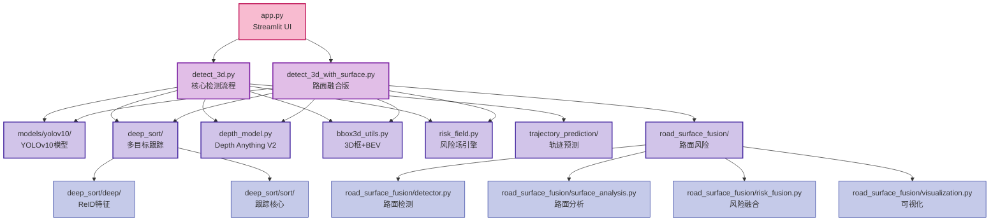

---

## 4. 感知链流程图

**题注：感知链流程示意图，展示了从2D检测到3D重建的完整过程**

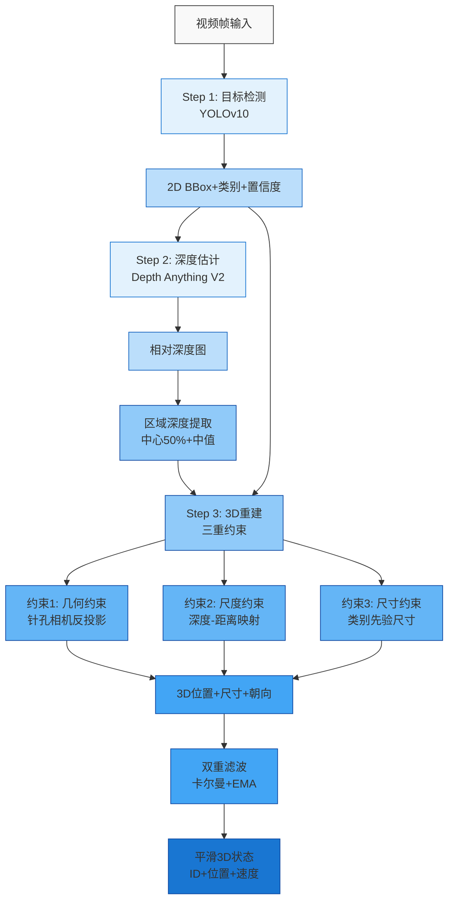

---

## 5. 跟踪链流程图

**题注：跟踪链流程示意图，展示了从3D状态到持续轨迹的跟踪过程**

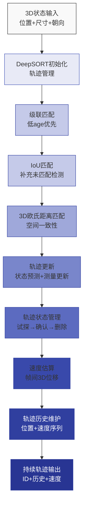

---

## 6. 风险链流程图

**题注：风险链流程示意图，展示了从3D轨迹到风险等级的计算过程**

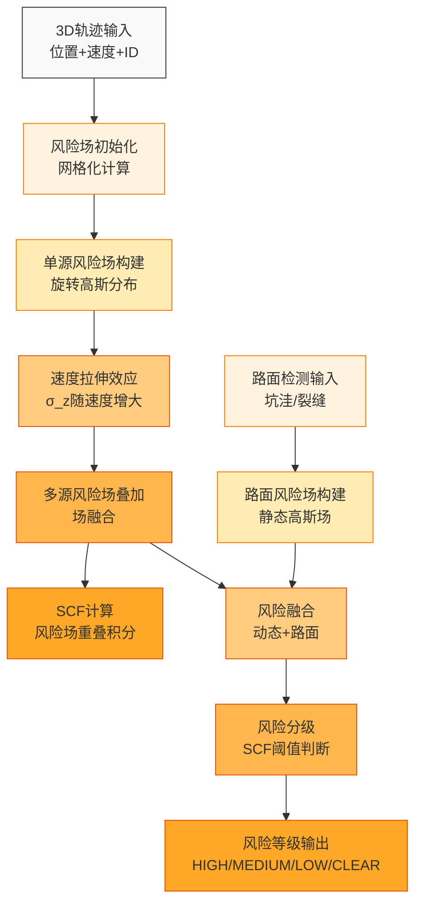

---

## 7. 呈现链流程图

**题注：呈现链流程示意图，展示了从风险数据到驾驶员感知的可视化过程**

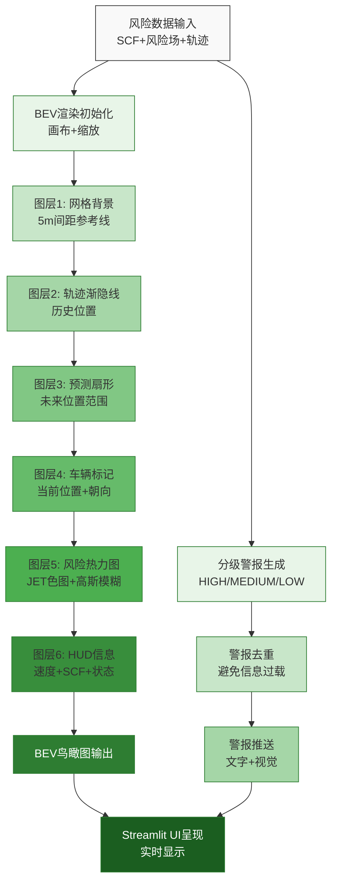

---

## 8. 3D重建流程图

**题注：3D边界框重建流程示意图，展示了从2D检测到3D位姿的完整过程**

```mermaid
flowchart TD
    A[2D BBox输入\n坐标+类别] --> B[框中心提取\n像素坐标(u,v)]
    B --> C[深度估计\n区域中值深度]
    C --> D[深度-距离映射\nZ=1+9d]
    D --> E[相机内参\nK矩阵]
    E --> F[针孔相机反投影\nX,Y,Z]
    F --> G[类别先验尺寸\n查表获取]
    G --> H[朝向估计\n宽高比+位置]
    H --> I[3D边界框生成\n位置+尺寸+朝向]
    I --> J[卡尔曼滤波\n11维状态向量]
    J --> K[EMA平滑\n时间域滤波]
    K --> L[平滑3D位姿输出]
    
    style A fill:#f9f9f9,stroke:#333,stroke-width:1px
    style B fill:#e3f2fd,stroke:#1976d2,stroke-width:1px
    style C fill:#bbdefb,stroke:#1565c0,stroke-width:1px
    style D fill:#90caf9,stroke:#0d47a1,stroke-width:1px
    style E fill:#90caf9,stroke:#0d47a1,stroke-width:1px
    style F fill:#64b5f6,stroke:#0d47a1,stroke-width:1px
    style G fill:#64b5f6,stroke:#0d47a1,stroke-width:1px
    style H fill:#42a5f5,stroke:#0d47a1,stroke-width:1px
    style I fill:#42a5f5,stroke:#0d47a1,stroke-width:1px
    style J fill:#1976d2,stroke:#0d47a1,stroke-width:1px
    style K fill:#1976d2,stroke:#0d47a1,stroke-width:1px
    style L fill:#0d47a1,stroke:#0d47a1,stroke-width:1px,color:#fff
```

---

## 9. 风险场计算流程图

**题注：风险场计算流程示意图，展示了从3D轨迹到高斯风险场的构建过程**

```mermaid
flowchart TD
    A[3D轨迹输入\nX,Y,Z,vx,vz] --> B[网格初始化\n-8~+8m × 0~25m]
    B --> C[速度拉伸计算\nσ_z = σ_z0 + v·α]
    C --> D[协方差矩阵构建\nΣ_local = diag(σ_x², σ_z²)]
    D --> E[速度方向计算\nθ = arctan(vx/vz)]
    E --> F[协方差旋转\nΣ_global = R·Σ_local·Rᵀ]
    F --> G[协方差逆矩阵\nΣ_inv = Σ_global⁻¹]
    G --> H[网格点坐标\nX_grid, Z_grid]
    H --> I[马氏距离计算\nd² = (p-μ)ᵀ·Σ_inv·(p-μ)]
    I --> J[高斯函数计算\nf = exp(-0.5d²)]
    J --> K[风险场归一化\n[0,1]范围]
    K --> L[多源风险场叠加\n场融合]
    L --> M[风险场输出\ngrid_h×grid_w]
    
    style A fill:#f9f9f9,stroke:#333,stroke-width:1px
    style B fill:#fff3e0,stroke:#f57c00,stroke-width:1px
    style C fill:#ffecb3,stroke:#f57c00,stroke-width:1px
    style D fill:#ffcc80,stroke:#e65100,stroke-width:1px
    style E fill:#ffcc80,stroke:#e65100,stroke-width:1px
    style F fill:#ffb74d,stroke:#e65100,stroke-width:1px
    style G fill:#ffb74d,stroke:#e65100,stroke-width:1px
    style H fill:#ffa726,stroke:#e65100,stroke-width:1px
    style I fill:#ffa726,stroke:#e65100,stroke-width:1px
    style J fill:#ff9800,stroke:#e65100,stroke-width:1px
    style K fill:#ff9800,stroke:#e65100,stroke-width:1px
    style L fill:#f57c00,stroke:#e65100,stroke-width:1px
    style M fill:#e65100,stroke:#e65100,stroke-width:1px,color:#fff
```

---

## 10. 卡尔曼滤波流程图

**题注：卡尔曼滤波器工作流程示意图，展示了预测-更新循环**

```mermaid
flowchart TD
    A[初始状态\nx0, P0] --> B[预测步骤\nx̂ = F·x + B·u]
    B --> C[预测协方差\nP̂ = F·P·Fᵀ + Q]
    C --> D[测量输入\nz = H·x + v]
    D --> E[残差计算\ny = z - H·x̂]
    E --> F[残差协方差\nS = H·P̂·Hᵀ + R]
    F --> G[卡尔曼增益\nK = P̂·Hᵀ·S⁻¹]
    G --> H[状态更新\nx = x̂ + K·y]
    H --> I[协方差更新\nP = (I - K·H)·P̂]
    I --> J[输出滤波状态\nx, P]
    J --> B
    
    style A fill:#f9f9f9,stroke:#333,stroke-width:1px
    style B fill:#e0f7fa,stroke:#006064,stroke-width:1px
    style C fill:#b2ebf2,stroke:#006064,stroke-width:1px
    style D fill:#80deea,stroke:#006064,stroke-width:1px
    style E fill:#4dd0e1,stroke:#006064,stroke-width:1px
    style F fill:#26c6da,stroke:#006064,stroke-width:1px
    style G fill:#00acc1,stroke:#006064,stroke-width:1px
    style H fill:#0097a7,stroke:#006064,stroke-width:1px
    style I fill:#00838f,stroke:#006064,stroke-width:1px
    style J fill:#006064,stroke:#006064,stroke-width:1px,color:#fff
```

---

## 11. 轨迹预测流程图

**题注：轨迹预测流程示意图，展示了基于匀速运动模型的预测过程**

```mermaid
flowchart TD
    A[3D状态输入\nX,Y,Z,vx,vz] --> B[预测步数设置\nN_steps=10]
    B --> C[预测时域计算\nT = N_steps·Δt]
    C --> D[匀速运动模型\np_k = p0 + k·Δt·v]
    D --> E[预测位置生成\n(x1,z1), (x2,z2), ...]
    E --> F[不确定性建模\nσ_k = σ0 + k·σ_growth]
    F --> G[预测风险场构建\n强度随步数衰减]
    G --> H[轨迹预测输出\n位置+不确定性+风险场]
    
    style A fill:#f9f9f9,stroke:#333,stroke-width:1px
    style B fill:#f3e5f5,stroke:#7b1fa2,stroke-width:1px
    style C fill:#e1bee7,stroke:#7b1fa2,stroke-width:1px
    style D fill:#ce93d8,stroke:#7b1fa2,stroke-width:1px
    style E fill:#ba68c8,stroke:#7b1fa2,stroke-width:1px
    style F fill:#ab47bc,stroke:#7b1fa2,stroke-width:1px
    style G fill:#9c27b0,stroke:#7b1fa2,stroke-width:1px
    style H fill:#6a0080,stroke:#7b1fa2,stroke-width:1px,color:#fff
```

---

## 12. 路面风险融合流程图

**题注：路面风险融合流程示意图，展示了动态风险与路面风险的融合过程**

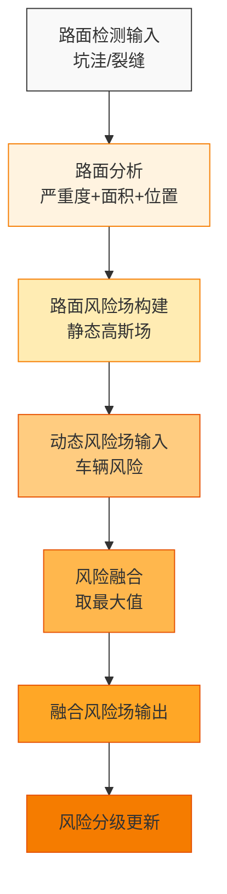

---

## 13. BEV可视化流程图

**题注：BEV鸟瞰图渲染流程示意图，展示了从风险数据到可视化输出的过程**

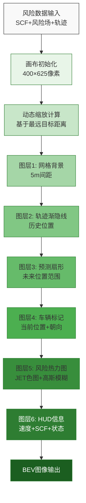

---

## 14. 系统版本演进图

**题注：系统版本演进图，展示了从V1.0到V6.0的功能迭代**

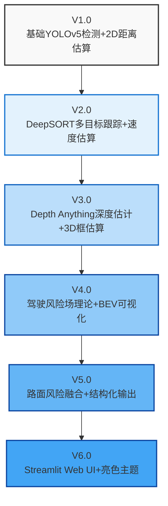

---

## 15. 硬件部署架构图

**题注：系统硬件部署架构图，展示了不同硬件配置下的部署方案**

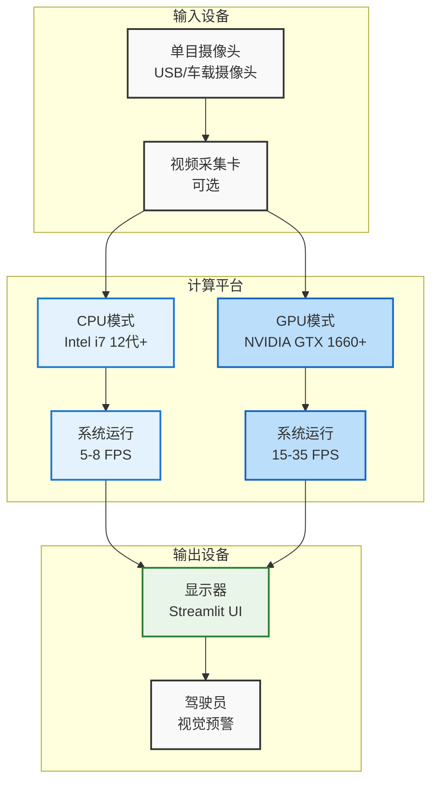

---

## 16. 深度估计流程图

**题注：深度估计流程示意图，展示了从RGB图像到深度图的生成过程**

```mermaid
flowchart TD
    A[RGB图像输入] --> B[模型加载\nDepth Anything V2]
    B --> C[前向推理\n特征提取]
    C --> D[深度图生成\n相对深度]
    D --> E[深度图归一化\n[0,1]范围]
    E --> F[区域深度提取\n中心50%+中值]
    F --> G[深度-距离映射\nZ=1+9d]
    G --> H[深度信息输出]
    
    style A fill:#f9f9f9,stroke:#333,stroke-width:1px
    style B fill:#e3f2fd,stroke:#1976d2,stroke-width:1px
    style C fill:#bbdefb,stroke:#1565c0,stroke-width:1px
    style D fill:#90caf9,stroke:#0d47a1,stroke-width:1px
    style E fill:#64b5f6,stroke:#0d47a1,stroke-width:1px
    style F fill:#42a5f5,stroke:#0d47a1,stroke-width:1px
    style G fill:#1976d2,stroke:#0d47a1,stroke-width:1px
    style H fill:#0d47a1,stroke:#0d47a1,stroke-width:1px,color:#fff
```

---

## 17. SCF计算流程图

**题注：SCF（Surrogate Conflict Field）计算流程示意图**

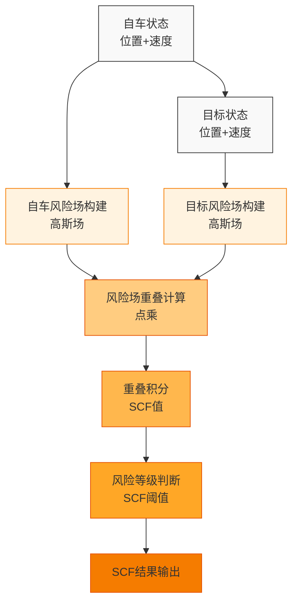

---

## 18. 预处理流水线流程图

**题注：视频预处理流程示意图，展示了从原始帧到模型输入的处理过程**

```mermaid
flowchart TD
    A[原始视频帧\nBGR格式] --> B[尺寸标准化\nLetterbox缩放]
    B --> C[色彩空间转换\nBGR→RGB]
    C --> D[归一化\n[0,255]→[0,1]]
    D --> E[张量化\nHWC→NCHW]
    E --> F[模型输入\n1×3×640×640]
    
    style A fill:#f9f9f9,stroke:#333,stroke-width:1px
    style B fill:#e3f2fd,stroke:#1976d2,stroke-width:1px
    style C fill:#bbdefb,stroke:#1565c0,stroke-width:1px
    style D fill:#90caf9,stroke:#0d47a1,stroke-width:1px
    style E fill:#64b5f6,stroke:#0d47a1,stroke-width:1px
    style F fill:#42a5f5,stroke:#0d47a1,stroke-width:1px
```

---

## 19. 速度估算流程图

**题注：速度估算流程示意图，展示了从3D位置到速度计算的过程**

```mermaid
flowchart TD
    A[3D位置历史\n(X1,Z1,t1), (X2,Z2,t2)] --> B[帧间时间差\nΔt = t2-t1]
    A --> C[3D位移计算\nΔX=X2-X1, ΔZ=Z2-Z1]
    B --> D[速度向量计算\nvx=ΔX/Δt, vz=ΔZ/Δt]
    C --> D
    D --> E[速度大小计算\nv=√(vx²+vz²)]
    E --> F[单位转换\nkph = v×3.6]
    F --> G[EMA平滑\n速度滤波]
    G --> H[速度输出\nkph]
    
    style A fill:#f9f9f9,stroke:#333,stroke-width:1px
    style B fill:#e8eaf6,stroke:#3f51b5,stroke-width:1px
    style C fill:#c5cae9,stroke:#303f9f,stroke-width:1px
    style D fill:#9fa8da,stroke:#303f9f,stroke-width:1px
    style E fill:#7986cb,stroke:#303f9f,stroke-width:1px
    style F fill:#5c6bc0,stroke:#303f9f,stroke-width:1px
    style G fill:#3949ab,stroke:#303f9f,stroke-width:1px
    style H fill:#303f9f,stroke:#303f9f,stroke-width:1px,color:#fff
```

---

## 20. 系统闭环验证图

**题注：系统闭环验证示意图，展示了从环境到驾驶员的完整反馈闭环**

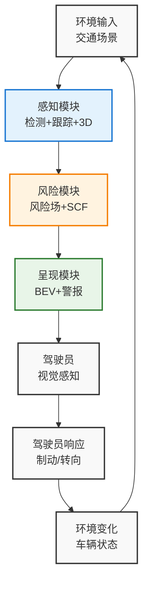

---

## 21. 模型选择决策树

**题注：模型选择决策流程，展示了YOLOv10和Depth Anything V2的选型过程**

```mermaid
decision
    A[选择目标检测模型] --> B{实时性要求?}
    B -->|是| C[YOLOv10-S\n7.2M参数, 8ms延迟]
    B -->|否| D[YOLOv10-X\n更大模型, 更高精度]
    
    E[选择深度估计模型] --> F{硬件条件?}
    F -->|CPU| G[Depth Anything V2-Small\n25M参数, 100ms/帧]
    F -->|GPU| H[Depth Anything V2-Base\n97M参数, 30ms/帧]
    
    style A fill:#f9f9f9,stroke:#333,stroke-width:1px
    style B fill:#e3f2fd,stroke:#1976d2,stroke-width:1px
    style C fill:#bbdefb,stroke:#1565c0,stroke-width:1px
    style D fill:#bbdefb,stroke:#1565c0,stroke-width:1px
    style E fill:#f9f9f9,stroke:#333,stroke-width:1px
    style F fill:#e3f2fd,stroke:#1976d2,stroke-width:1px
    style G fill:#bbdefb,stroke:#1565c0,stroke-width:1px
    style H fill:#bbdefb,stroke:#1565c0,stroke-width:1px
```

---

## 22. 风险等级划分图

**题注：风险等级划分示意图，展示了SCF值与风险等级的对应关系**

```mermaid
graph TD
    A[SCF值] --> B[<0.25\nCLEAR]
    A --> C[0.25-0.55\nLOW]
    A --> D[0.55-0.8\nMEDIUM]
    A --> E[≥0.8\nHIGH]
    
    B --> F[无警报\n正常驾驶]
    C --> G[注意周围车辆\n保持关注]
    D --> H[注意周围车辆\n准备制动]
    E --> I[前方碰撞风险高!\n立即制动]
    
    style A fill:#f9f9f9,stroke:#333,stroke-width:2px
    style B fill:#e8f5e8,stroke:#2e7d32,stroke-width:2px
    style C fill:#fff8e1,stroke:#ffb300,stroke-width:2px
    style D fill:#ffe0b2,stroke:#ff8f00,stroke-width:2px
    style E fill:#ffebee,stroke:#c62828,stroke-width:2px
    style F fill:#e8f5e8,stroke:#2e7d32,stroke-width:1px
    style G fill:#fff8e1,stroke:#ffb300,stroke-width:1px
    style H fill:#ffe0b2,stroke:#ff8f00,stroke-width:1px
    style I fill:#ffebee,stroke:#c62828,stroke-width:1px
```

---

## 23. 硬件性能对比图

**题注：不同硬件配置下的系统性能对比**

```mermaid
graph TD
    A[硬件配置] --> B[CPU (i7-12700)]
    A --> C[GPU (GTX 1660)]
    A --> D[GPU (RTX 3060)]
    
    B --> E[检测延迟: ~80ms]
    B --> F[深度延迟: ~100ms]
    B --> G[总帧率: 5-8 FPS]
    
    C --> H[检测延迟: ~8ms]
    C --> I[深度延迟: ~100ms]
    C --> J[总帧率: 15-20 FPS]
    
    D --> K[检测延迟: ~5ms]
    D --> L[深度延迟: ~11ms]
    D --> M[总帧率: 25-35 FPS]
    
    style A fill:#f9f9f9,stroke:#333,stroke-width:2px
    style B fill:#e3f2fd,stroke:#1976d2,stroke-width:2px
    style C fill:#bbdefb,stroke:#1565c0,stroke-width:2px
    style D fill:#90caf9,stroke:#0d47a1,stroke-width:2px
    style E fill:#e3f2fd,stroke:#1976d2,stroke-width:1px
    style F fill:#e3f2fd,stroke:#1976d2,stroke-width:1px
    style G fill:#e3f2fd,stroke:#1976d2,stroke-width:1px
    style H fill:#bbdefb,stroke:#1565c0,stroke-width:1px
    style I fill:#bbdefb,stroke:#1565c0,stroke-width:1px
    style J fill:#bbdefb,stroke:#1565c0,stroke-width:1px
    style K fill:#90caf9,stroke:#0d47a1,stroke-width:1px
    style L fill:#90caf9,stroke:#0d47a1,stroke-width:1px
    style M fill:#90caf9,stroke:#0d47a1,stroke-width:1px
```

---

## 24. 系统启动流程图

**题注：系统启动流程示意图，展示了从程序启动到正常运行的过程**

```mermaid
flowchart TD
    A[程序启动] --> B[参数解析\n命令行参数]
    B --> C[模型加载\nYOLOv10+Depth Anything]
    C --> D[设备分配\nGPU/CPU]
    D --> E[模型预热\n前向传播]
    E --> F[视频源初始化\n摄像头/文件]
    F --> G[UI初始化\nStreamlit]
    G --> H[主循环\n检测+跟踪+风险+呈现]
    H --> I[系统运行中]
    
    style A fill:#f9f9f9,stroke:#333,stroke-width:1px
    style B fill:#e3f2fd,stroke:#1976d2,stroke-width:1px
    style C fill:#bbdefb,stroke:#1565c0,stroke-width:1px
    style D fill:#90caf9,stroke:#0d47a1,stroke-width:1px
    style E fill:#64b5f6,stroke:#0d47a1,stroke-width:1px
    style F fill:#42a5f5,stroke:#0d47a1,stroke-width:1px
    style G fill:#1976d2,stroke:#0d47a1,stroke-width:1px
    style H fill:#0d47a1,stroke:#0d47a1,stroke-width:1px,color:#fff
    style I fill:#0d47a1,stroke:#0d47a1,stroke-width:1px,color:#fff
```

---

## 25. 未来进化方向图

**题注：系统未来进化方向示意图，展示了从L2到L4的技术升级路径**

```mermaid
graph TD
    A[当前系统\nL2辅助驾驶] --> B[多传感器融合\n激光雷达+毫米波]
    A --> C[声音预警实现\n分级声音报警]
    A --> D[TensorRT加速\n边缘部署]
    A --> E[V2X通信\n车路协同]
    
    B --> F[L3自动驾驶\n条件自动驾驶]
    C --> F
    D --> F
    E --> F
    
    F --> G[L4自动驾驶\n高度自动驾驶]
    
    style A fill:#f9f9f9,stroke:#333,stroke-width:2px
    style B fill:#e3f2fd,stroke:#1976d2,stroke-width:2px
    style C fill:#bbdefb,stroke:#1565c0,stroke-width:2px
    style D fill:#90caf9,stroke:#0d47a1,stroke-width:2px
    style E fill:#64b5f6,stroke:#0d47a1,stroke-width:2px
    style F fill:#42a5f5,stroke:#0d47a1,stroke-width:2px
    style G fill:#1976d2,stroke:#0d47a1,stroke-width:2px
```

---

## 总结

本Mermaid图表集涵盖了驭安DriveSafe系统的各个方面，包括：

1. **架构与流程**：系统整体架构、数据流、模块依赖等
2. **核心算法**：3D重建、风险场计算、卡尔曼滤波等
3. **功能模块**：感知、跟踪、风险、呈现等
4. **技术决策**：模型选择、硬件部署、版本演进等
5. **未来规划**：技术升级、自动驾驶演进等

所有图表均基于系统的实际工程实现，可直接用于技术文档、演示文稿等场景。通过这些图表，可直观理解系统的设计理念、工作原理和技术细节。